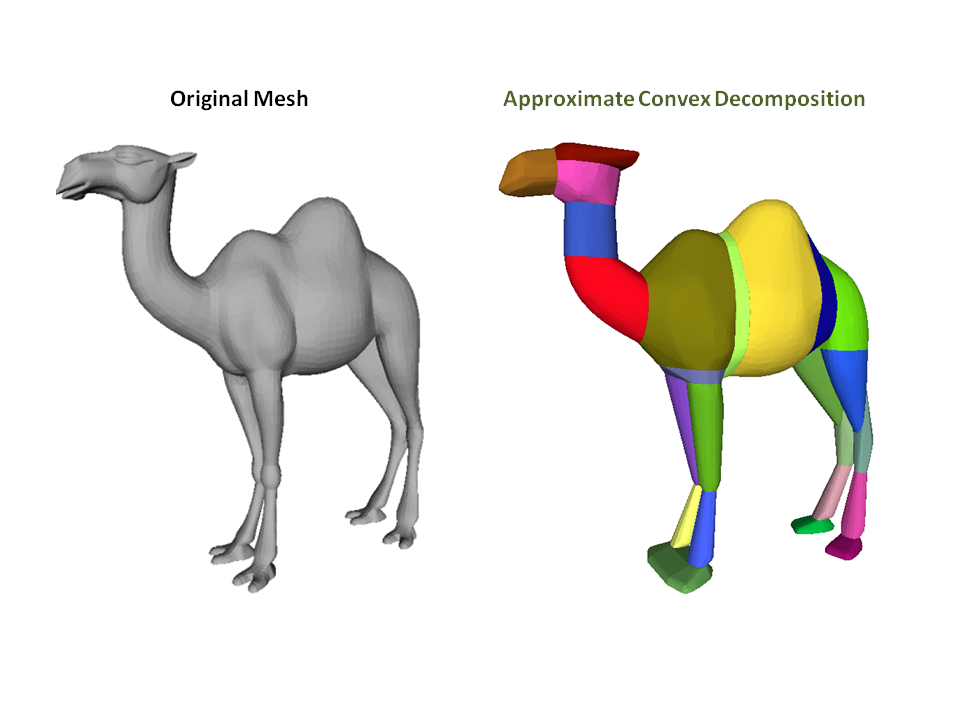
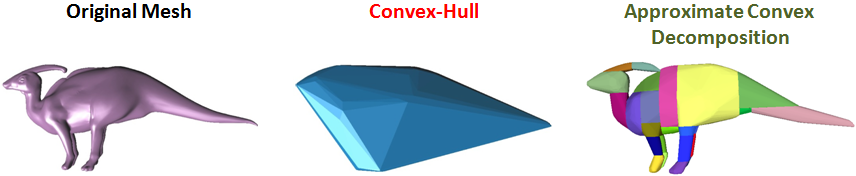
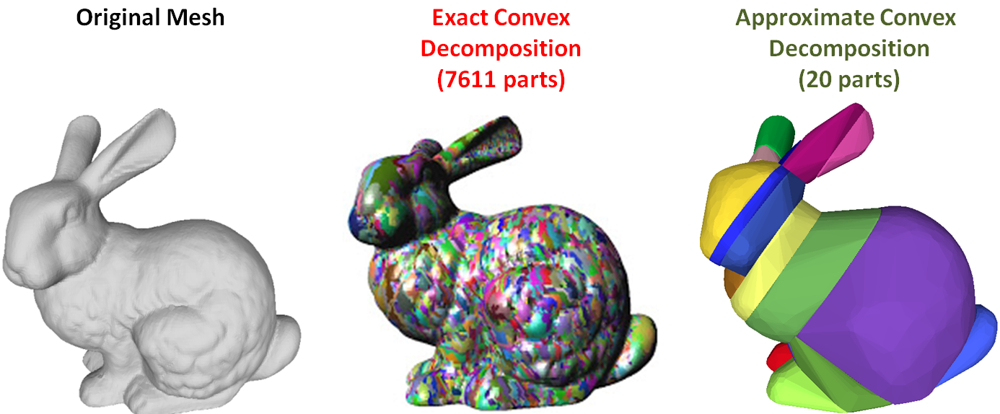

# The V-HACD library decomposes a 3D surface into a set of "near" convex parts.

# Why do we need approximate convex decomposition?

Collision detection is essential for [realistic physical interactions](https://www.youtube.com/watch?v=oyjE5L4-1lQ) in video games and computer animation. In order to ensure real-time interactivity with the player/user, video game and 3D modeling software developers usually approximate the 3D models composing the scene (e.g. animated characters, static objects...) by a set of simple convex shapes such as ellipsoids, capsules or convex-hulls. In practice, these simple shapes provide poor approximations for concave surfaces and generate false collision detection.

A second approach consists in computing an exact convex decomposition of a surface S, which consists in partitioning it into a minimal set of convex sub-surfaces. Exact convex decomposition algorithms are NP-hard and non-practical since they produce a high number of clusters. To overcome these limitations, the exact convexity constraint is relaxed and an approximate convex decomposition of S is instead computed. Here, the goal is to determine a partition of the mesh triangles with a minimal number of clusters, while ensuring that each cluster has a concavity lower than a user defined threshold.

# Installing the Package

On Windows, go to the ./app directory and run 'cmake CMakeLists.txt' and then load the solution file
On Linux, go to the ./app directory and run 'cmake -DCMAKE_BUILD_TYPE=Release CMakeLists.txt' and then run 'cmake --build .' to build the test app

# Documentation
Click this link to find detailed documentation for how to use the library:

(https://docs.google.com/presentation/d/1OZ4mtZYrGEC8qffqb8F7Le2xzufiqvaPpRbLHKKgTIM/edit?usp=sharing)

# Announcing Version 4.0 release!!

Version 4.0 of V-HACD was officially released on April 7, 2022

The previous version has been archived on a branch called 'version.3.1' should you need it.

Version 4.0 is a near complete rewrite of the V-HACD code.

The API is mostly the same with just some minor changes.

V-HACD version 4.0 is now a header file only library!  Just one source file is needed.

V-HACD version 4.0 is faster, more robust, stable, and has fewer bugs than the older version.

Going forward version 4.0 and higher are the only versions which will receive technical support.

The earlier versions are now completely deprecated and will not be supported anymore.

# Porting guide

The new version is a single header file. You simply need to define '#define ENABLE_VHACD_IMPLEMENTATION 1' prior to including 'VHACD.h' in *one* CPP file in your project.

There are no link libraries for V-HACD. There are no CPP files either. Just the one header file.

The tuning parameter 'm_concavity' has been removed and is now replaced by 'm_minimumVolumePercentErrorAllowed'

The tuning parameters 'm_alpha' and 'm_beta' are gone and no longer used.

The tuning parameter 'm_projectHullVertices' has been renamed 'm_shrinkWrap'

The function signature for the Update call in IUserCallback has changed slightly to the following:

        virtual void Update(const double overallProgress,
                            const double stageProgress,
                            const char* const stage,const char *operation) final
